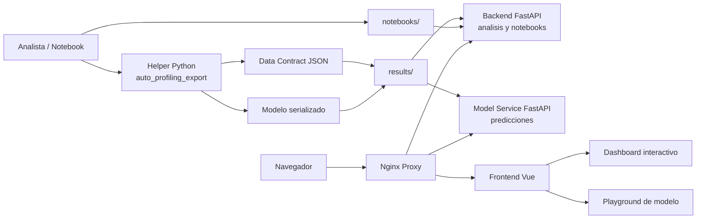
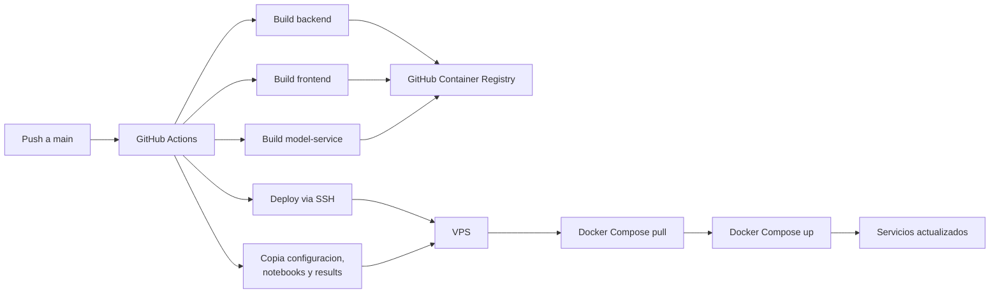

# Auto Profiling

Auto Profiling es una plataforma web para convertir analisis de datos y modelos de Machine Learning en dashboards interactivos. El proyecto combina notebooks de trabajo, una libreria helper para exportar resultados como Data Contracts JSON, una SPA en Vue 3 para visualizacion, un backend FastAPI para servir analisis/notebooks y un microservicio independiente para predicciones con modelos serializados.

El repositorio esta pensado como un proyecto de portfolio tecnico: muestra un flujo completo desde exploracion en Jupyter hasta visualizacion web, model serving, contenerizacion y despliegue continuo.

## Caracteristicas principales

- Galeria de analisis exportados como Data Contracts JSON.
- Visualizacion de KPIs, graficos Chart.js, tablas con busqueda/orden/paginacion, matrices de correlacion, matrices de confusion, texto Markdown, snippets de codigo e imagenes.
- Vista de comparacion side-by-side entre dos analisis.
- Ingestion interna de notebooks, Data Contracts y artefactos de modelos desde el repositorio o el entorno de despliegue.
- Sin subida publica de archivos desde la interfaz ni endpoints publicos de carga.
- Soporte legacy para renderizar notebooks `.ipynb` directamente.
- Playground de modelos: genera formularios desde `input_schema` y consulta predicciones en vivo.
- Libreria Python `auto-profiling-export` para construir reportes, componentes y artefactos `.joblib`.
- Despliegue Docker con `backend`, `frontend`, `model-service` y proxy Nginx.
- CI/CD con GitHub Actions y publicacion de imagenes en GitHub Container Registry.

## Flujo general



El flujo recomendado es crear o actualizar un notebook, usar el helper para exportar un Data Contract JSON y, si corresponde, un modelo `.joblib`. Los archivos resultantes se incorporan internamente en `results/`; los notebooks fuente viven en `notebooks/`. La aplicacion no acepta cargas publicas desde el navegador.

## Estructura del repositorio

```text
.
|-- backend/                  # API principal: analisis JSON y notebooks legacy
|-- frontend/                 # SPA Vue 3, renderers y vistas interactivas
|-- helper/                   # Libreria Python auto-profiling-export
|-- model-service/            # API de modelos y predicciones
|-- notebooks/                # Notebooks fuente incluidos en el proyecto
|-- results/                  # Data Contracts JSON y artefactos joblib
|-- proxy/                    # Nginx que enruta frontend, backend y model-service
|-- docker-compose.yml        # Orquestacion local/produccion
`-- .github/workflows/        # Pipeline de build y deploy
```

## Stack tecnico

| Capa | Tecnologias |
|---|---|
| Frontend | Vue 3, Vite, Vue Router, Chart.js, chartjs-plugin-zoom, Reka UI, Tailwind CSS 4 |
| Backend | FastAPI, Pydantic, pydantic-settings, Uvicorn |
| Model serving | FastAPI, joblib, scikit-learn, XGBoost, NumPy |
| Helper Python | setuptools, pytest, pandas opcional, joblib opcional |
| Infraestructura | Docker, Docker Compose, Nginx, GitHub Actions, GHCR |

## Analisis incluidos

El repositorio trae dos casos de estudio exportados en `results/`:

| Analisis | Archivo | Tipo | Modelo |
|---|---|---|---|
| Dota 2 Pro Matches - Analisis | `results/dota2-pro-matches.json` | Clasificacion binaria con feature engineering historico | `dota2-pro-matches_model.joblib` |
| OTT Movies & Series - Analisis | `results/ott-movies-series.json` | Regresion de rating y recomendacion content-based | `ott-movies-series_model.joblib` |

Tambien se incluyen los notebooks fuente:

- `notebooks/Dota_2_Pro_Matches.ipynb`
- `notebooks/OTT_Movies_Series.ipynb`

## Ejecucion con Docker Compose

Requisitos:

- Docker
- Docker Compose

El `docker-compose.yml` usa una red externa llamada `portfolio-net`, porque el proyecto esta preparado para convivir con un proxy de portfolio. Para ejecutarlo localmente por primera vez:

```bash
docker network create portfolio-net
docker compose up --build
```

Luego abre la URL configurada para el proxy local.

Rutas principales expuestas por el proxy:

| Ruta | Servicio destino |
|---|---|
| `/` | Frontend Vue servido por Nginx |
| `/v1/analyses/*` | Backend FastAPI |
| `/v1/notebooks/*` | Backend FastAPI |
| `/v1/models/*` | Model service FastAPI |
| `/health` | Backend FastAPI |

## Desarrollo local sin Docker

### Backend

```bash
cd backend
python -m venv .venv
source .venv/bin/activate
pip install -r requirements.txt
PROFILING_NOTEBOOKS_DIR=../notebooks PROFILING_RESULTS_DIR=../results uvicorn main:app --reload
```

### Model service

```bash
cd model-service
python -m venv .venv
source .venv/bin/activate
pip install -r requirements.txt
MODEL_RESULTS_DIR=../results uvicorn main:app --reload
```

### Frontend

```bash
cd frontend
npm install
npm run dev
```

Vite enruta las llamadas relativas hacia los servicios locales configurados en `frontend/vite.config.js`.

## API principal

### Analisis

| Metodo | Ruta | Descripcion |
|---|---|---|
| `GET` | `/v1/analyses` | Lista Data Contracts disponibles en `results/` |
| `GET` | `/v1/analyses/{analysis_id}` | Retorna un Data Contract completo |

### Notebooks legacy

| Metodo | Ruta | Descripcion |
|---|---|---|
| `GET` | `/v1/notebooks` | Lista notebooks disponibles en `notebooks/` |
| `GET` | `/v1/notebooks/{notebook_id}` | Retorna un notebook parseado |

### Modelos

| Metodo | Ruta | Descripcion |
|---|---|---|
| `GET` | `/v1/models` | Lista modelos descubiertos desde Data Contracts |
| `GET` | `/v1/models/{model_id}` | Retorna metadata de un modelo |
| `POST` | `/v1/models/{model_id}/predict` | Ejecuta una prediccion |
| `GET` | `/v1/models/{model_id}/stats` | Retorna estadisticas en memoria del servicio |

Ejemplo de prediccion:

```bash
curl -X POST /v1/models/dota-2-pro-matches-analisis/predict \
  -H "Content-Type: application/json" \
  -d '{"features":{"team1_player_wr":0.56,"team2_player_wr":0.51,"player_skill_diff":0.05,"team1_avg_exp":167.2,"team2_avg_exp":433,"exp_diff":-265.8,"month":8,"hour":10,"bestOf_1.0":0,"bestOf_2.0":0,"bestOf_3.0":1,"bestOf_4.0":0,"bestOf_5.0":0,"bestOf_6.0":0,"bestOf_7.0":0}}'
```

## Ingestion interna

La plataforma no expone subida publica de archivos. Para agregar o actualizar contenido:

1. Crea o actualiza el notebook en `notebooks/`.
2. Exporta el Data Contract con `auto-profiling-export`.
3. Guarda el JSON y, si corresponde, el modelo `.joblib` en `results/`.
4. Despliega los cambios mediante el flujo de CI/CD o actualiza el volumen interno del entorno controlado.

Esta decision reduce la superficie publica de ataque: el frontend no muestra controles de subida y el backend no publica rutas de carga de archivos.

## Data Contract

El Data Contract es el formato central entre notebooks, backend, frontend y model-service. Un analisis minimo tiene esta forma:

```json
{
  "metadata": {
    "id": "mi-analisis",
    "title": "Mi Analisis",
    "description": "Descripcion breve",
    "author": "Autor",
    "created_at": "2026-05-08T21:06:59.084135+00:00",
    "tags": ["machine-learning", "eda"],
    "colab_url": null,
    "github_url": null
  },
  "kpis": [
    {
      "label": "Accuracy",
      "value": "66.9%",
      "description": "Resultado sobre test set",
      "severity": "ok"
    }
  ],
  "sections": [
    {
      "title": "Resultados",
      "description": "Resumen de evaluacion",
      "components": [
        {
          "type": "text",
          "content": "Conclusiones principales en Markdown."
        }
      ]
    }
  ],
  "model": {
    "artifact": "mi-analisis_model.joblib",
    "format": "joblib",
    "input_schema": ["feature_1", "feature_2"],
    "sample_input": {"feature_1": 1, "feature_2": 0.5},
    "metrics": {"accuracy": 0.669}
  }
}
```

Tipos de componentes soportados:

| Tipo | Uso |
|---|---|
| `chart` | Graficos `bar`, `line`, `scatter`, `pie` y variantes compatibles con Chart.js |
| `dataframe` | Tablas con busqueda, orden y paginacion |
| `metric_grid` | Colecciones de metricas o KPIs |
| `text` | Markdown renderizado |
| `correlation_matrix` | Heatmap de correlaciones |
| `confusion_matrix` | Matriz de confusion con totales y porcentajes |
| `code_snippet` | Bloques de codigo |
| `image` | Imagenes embebidas por URL, data URI o ruta servible |

## Uso de la libreria helper

El paquete local `helper/` permite construir Data Contracts desde Python.

Instalacion editable:

```bash
cd helper
python -m venv .venv
source .venv/bin/activate
pip install -e ".[pandas,ml,dev]"
```

Ejemplo basico:

```python
from auto_profiling_export import Report, Section, chart, dataframe, export_model

report = Report(
    "Mi Analisis",
    description="Dashboard exportado desde notebook",
    author="Triplerush",
    tags=["machine-learning", "eda"],
)

report.add_kpi("Accuracy", "66.9%", "Evaluacion en test", severity="ok")

section = Section("Exploracion")
section.add(chart.bar(["A", "B"], [{"label": "conteo", "data": [10, 20]}], title="Distribucion"))
report.add_section(section)

# Opcional: adjuntar un modelo sklearn-compatible
model_info = export_model(
    model=model,
    analysis_id=report.metadata["id"],
    input_schema=list(X_train.columns),
    sample_input=X_train.iloc[0].to_dict(),
    metrics={"accuracy": 0.669},
    output_dir="../results",
)
report.set_model(model_info)

report.save("../results/mi-analisis.json")
```

La validacion exige metadata basica, al menos una seccion con componentes validos y, cuando existe `model`, las claves `artifact`, `format`, `input_schema`, `sample_input` y `metrics`.

## Frontend

Rutas de la SPA:

| Ruta | Vista |
|---|---|
| `/` | Galeria de analisis y notebooks legacy |
| `/analysis/:id` | Dashboard de un Data Contract |
| `/notebook/:id` | Render de notebook `.ipynb` |
| `/compare` | Comparacion entre dos analisis |

Los renderers viven en `frontend/src/components/renderers/` y se seleccionan por el campo `type` de cada componente del Data Contract.

## CI/CD y despliegue



El workflow `.github/workflows/deploy.yml` se ejecuta en pushes a `main`:

1. Construye imagenes Docker de `backend`, `frontend` y `model-service`.
2. Publica las imagenes en GitHub Container Registry.
3. Se conecta al VPS por SSH.
4. Copia `docker-compose.yml`, `proxy/`, `notebooks/` y `results/`.
5. Ejecuta `docker compose pull` y `docker compose up -d`.

El frontend se construye en CI con `VITE_BASE_PATH=/profiling/`, lo que permite servir la aplicacion bajo el subpath del portfolio.

## Tests

La cobertura automatizada actual esta centrada en la libreria helper:

```bash
cd helper
pip install -e ".[pandas,ml,dev]"
pytest
```

Los tests verifican construccion de reportes, guardado JSON, validaciones, histogramas, matrices de confusion, graficos horizontales y conversion de DataFrames.

## Estado actual

El proyecto ya tiene implementada la plataforma principal de visualizacion, comparacion, ingestion interna, helper de exportacion, model-service y despliegue Docker. Las areas naturales de evolucion son una capa AI para explicacion de dashboards, busqueda semantica sobre Data Contracts, explicaciones LLM para predicciones y observabilidad mas profunda del servicio de modelos.
